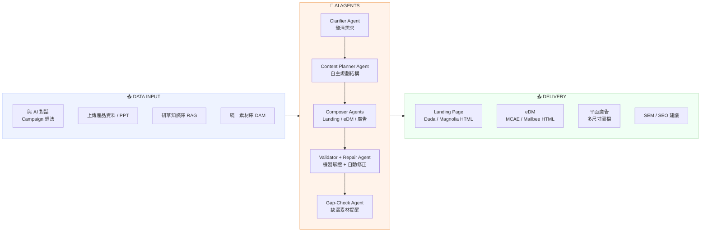
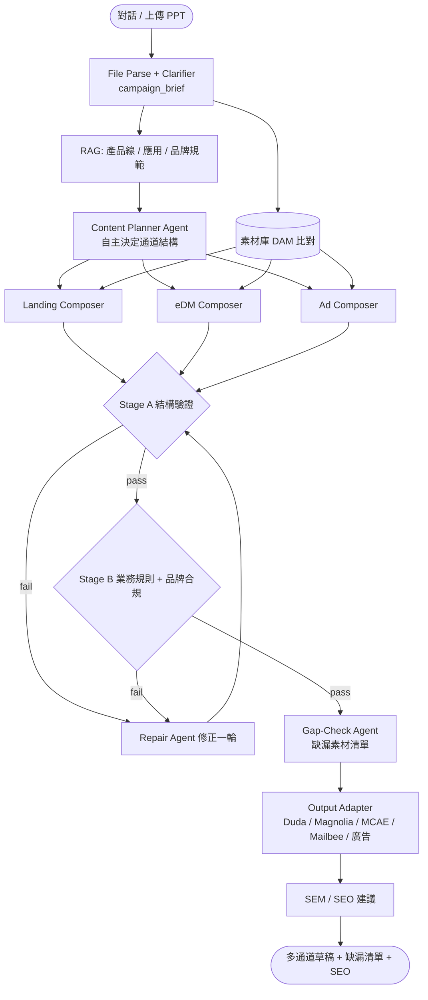

# AI Agent 競賽提案文件 — Marcom Agent Studio

> 作品名稱：**Marcom Agent Studio — Product Content Marketing 全自動化 AI Agent**
> 版本：v1.0　日期：2026-06-18
> 性質：競賽提案 + 技術說明　｜　參賽類別：企業流程自動化 AI Agent
> 一句話定位：讓 B2B Marketer 用「一段對話 + 一份產品資料」，自助完成整檔 Campaign 的 Landing Page、eDM、平面廣告與 SEM/SEO 素材。

---

## 一、應用場景（Application Scenario）

研華（Advantech）作為全球工業電腦與 IoT 領導品牌，每年要為數百條產品線、跨 TW / CN / NA / EU 多區域市場推出產品上市（New Release）與選型指南（Selection Guide）類型的行銷 Campaign。B2B 行銷的特性是**決策週期長、利害關係人多（採購、IT 主管、終端工程師）、且高度依賴理性數據與技術驗證**，這讓每一檔 Campaign 的準備工作異常繁雜。

目前 Marketer 啟動一檔 Campaign，必須橫跨四大工作流：**策略企劃、內容與視覺素材、數位資產落地、媒體投放**。在實際執行上，這些環節衍生出六個反覆消耗工時的痛點：

1. **與設計團隊反覆溝通、品牌視覺不停 Review。** 主視覺（KV）、Banner、Landing Page 版型每一輪都要來回確認，光是視覺對齊就佔據大量時程。
2. **大量產品資料檢索耗時。** 工程級產品的規格、認證、應用場景散落在不同文件，Marketer 要逐一查找、確認數值正確性。
3. **微調頁面卻花費大量時間。** 即使有 CMS，拼裝頁面、調整排版、對齊 RWD 仍需要前端或設計支援。
4. **素材庫圖片沒有統一管理。** 產品去背圖、認證標章、情境圖分散各處，常找不到合規、高解析度的版本。
5. **設計語彙與 A/B 外包廠商不統一。** 不同檔期、不同廠商產出的視覺語言不一致，稀釋品牌一致性。
6. **單檔 Campaign 要準備的東西太多、太繁雜。** 同一檔活動往往同時要 Landing Page、eDM、展會平面廣告、SEM/SEO 關鍵字，每種通道各有格式與規範。

**Marcom Agent Studio 解決的核心問題**：把上述「跨團隊、跨通道、跨文件」的協作負擔，收斂成一個 AI Agent 的自助流程。Marketer 在開始 Campaign 前，只要**與平台 AI 對話**，或**直接上傳產品資料 / 想法 PPT**，Agent 就會主動釐清活動目標、受眾、產品線與要產出的通道，接著從研華知識庫檢索正確的產品與應用資訊、從統一素材庫挑選合規圖片，依照**事前封裝、符合研華品牌的多樣化元件與視覺模板**，一次組裝出整套 Campaign 內容——包含文案與圖片。

完成後，Agent 會**主動提醒尚缺哪些素材**（例如「缺 XXX 產品去背高解析主圖」「此頁宣稱 IP66 需提供對應標章」），並支援**一鍵複製 HTML** 部署到既有通道：Landing Page 可輸出 Duda / Magnolia 版、eDM 可輸出 MCAE / Mailbee 版，平面廣告輸出多尺寸圖檔，最後附上**參考用 SEM / SEO 建議**。

換言之，這個 Agent 把一檔需要設計、文案、前端、資料檢索多方協作、動輒數天的 B2B Campaign 籌備，壓縮成 Marketer 可在數分鐘內自助完成首稿、再做局部微調的流程，直接命中 B2B 行銷「太多、太繁雜、太依賴跨團隊」的結構性痛點。

---

## 二、實施方法與技術架構（Implementation Method & Technical Architecture）

### 運作方式

Marcom Agent Studio 採用**多 Agent 編排 + 資料驅動元件庫**的架構，整體流程分為七層：

1. **輸入層**：接收 Marketer 的對話或上傳檔案（PPT / 規格表 / 產品重點），由 File Parse 與 Clarifier 節點萃取意圖、產品線、受眾，並補問關鍵缺口，整合成 `campaign_brief`（含要產出的通道清單）。
2. **知識擷取層**：以 RAG 從三個知識庫（產品線、應用場景、品牌規範 / 法規）檢索，所有產品宣稱**強制附 citation**；同時查詢素材庫（DAM）比對可用且 `brand_approved` 的圖片。
3. **規劃層**：Content Planner Agent 依 brief 與檢索結果，**自主決定**各通道的結構、區塊排序與訊息策略。
4. **多通道組裝層**：Landing / eDM / 平面廣告各有獨立 Composer Agent，依規劃輸出結構化 JSON（`draft_payload` / `edm_payload` / `ad_payload`），嚴格對照元件 Schema。
5. **驗證層**：兩段式機器驗證——**Stage A 結構驗證**（JSON Schema）與 **Stage B 業務規則 / 品牌合規**（sectionType enum、字數、URL、色碼、禁用詞）。失敗自動進入 Repair Agent 修正一輪，仍失敗則轉人工審查。
6. **缺漏檢查層**：Gap Check 比對「必要素材 vs. 已取得素材」，輸出阻擋輸出（必填）與建議補強（選填）兩級清單。
7. **輸出層**：Output Adapter 依通道轉出 Duda / Magnolia / MCAE / Mailbee HTML 或多尺寸廣告圖檔，並附 SEM/SEO 建議。

### 核心技術

- **資料驅動元件庫**：既有的 Campaign Page Builder（Landing）與 Newsletter Customizer（eDM）以純 JSON 表達頁面（sections / options / edits），渲染完全由資料決定。AI 因此**不需要寫 HTML**，只需產出合法 JSON，大幅降低幻覺風險。
- **嚴格 Schema 合約**：每個元件有固定 `optionMap` / `editMap`，可導出 JSON Schema 做機器驗證，杜絕 AI 自創欄位或不合規視覺。
- **RAG + 素材庫雙來源**：文案來自知識庫檢索（可追溯），圖片來自統一 DAM（合規、已授權），兩者皆「查無則標記缺漏、不捏造」。
- **多 Agent 編排**：以 Workflow 引擎（如 Dify）串接 Planner / Composer / Repair 等節點，支援條件分支與修正回圈。

### 符合 AI Agent 定義之處

本作品明確具備競賽細則的兩大能力：

- **主動決策能力（Autonomous Decision-making）**：Agent 不是被動填空，而是會**主動判斷**：依 brief 決定要用哪些 Section、如何排序、套哪種 Style；驗證失敗時自主啟動 Repair 修正；素材不足時主動產生待補清單；依使用者選擇的通道分流到不同 Composer。整個規劃—組裝—驗證—修正—缺漏提醒的決策鏈，由 Agent 自行完成。
- **環境互動能力（Environment Interaction）**：Agent 與多個外部系統雙向互動——讀取知識庫（RAG）、查詢素材庫（DAM）、呼叫 Schema 驗證服務、寫入 Builder 專案、觸發各通道 Output Adapter 產出 HTML / 圖檔。它感知環境狀態（素材是否齊全、驗證是否通過）並據此採取行動，而非單純的一次性文字生成。

---

## 三、量化成效與實施成果（Quantitative Benefits & Implementation Results）

### 現況基準（導入前）

依研華 B2B Campaign 的實務經驗，單檔活動的籌備瓶頸如下（作為對照基準）：

| 工作項目 | 導入前現況 | 主要瓶頸 |
|---|---|---|
| Landing Page 首版 | 3–5 個工作天 | 設計溝通、前端拼裝、來回 Review |
| eDM 版面 | 1–2 個工作天 | 切圖、HTML 相容性調整 |
| 平面廣告多尺寸 | 1–2 個工作天 | 重複套版、解析度規格 |
| 產品資料檢索與校對 | 數小時 / 檔 | 規格散落、需逐一確認 |
| 跨團隊協作往返 | 多輪 | 設計 / 文案 / 前端 / 產品 PM |

### 導入後目標效益

| 指標 | 目標值 | 效益說明 |
|---|---|---|
| 整套 Campaign 首稿生成時間 | **≤ 5 分鐘** | 多通道同時產出，取代數個工作天 |
| 單通道首稿生成時間 | **≤ 2 分鐘** | 對話到可預覽草稿 |
| 首稿可接受率（僅需微調） | **≥ 60%** | 減少打掉重做 |
| 平均人工修改次數 | **≤ 5 處 / 通道** | 元件化 + 合規生成 |
| 產品事實錯誤率 | **0%**（人工確認後發布） | RAG 強制 citation + 機器驗證 |
| Campaign 籌備總工時縮短 | **≥ 50%** | 跨團隊協作收斂為自助流程 |
| 品牌視覺一致性 | **100% 元件合規** | 只能用封裝元件，杜絕外包語彙不一 |

### 已驗證的實施成果（Current Progress）

- **元件庫已就緒並驗證可輸出**：Campaign Page Builder 已實作 12 套符合研華品牌的 Style、25+ 通用 Section，並已驗證可一鍵輸出 Duda / Magnolia 可部署 HTML；Newsletter Customizer 已產出 eDM 元件，對應 MCAE / Mailbee。
- **資料驅動架構已落地**：頁面以 JSON（sections / options / edits）表達、即時渲染、即時預覽，並具 localStorage 專案持久化與復原機制——這是 AI 只需產 JSON 即可生成頁面的技術前提。
- **產品資料庫已建置**：內建 `product-database.js` 結構化產品資料，供 Composer 取用 Part Number、規格、CTA。
- **素材 / 情境庫機制已運作**：Builder 內建情境圖庫與搜尋，已可在拼裝時取用素材，為 DAM 統一管理打底。

> 上述代表「人工版工具鏈」已驗證可行且穩定，AI Agent 層是在此成熟基礎上接管「規劃—組裝—驗證—缺漏提醒」決策，落地風險低。

---

## 四、未來展望（Future Outlook）

Marcom Agent Studio 的長期願景，是從「單檔 Campaign 內容產生器」演進為**研華全球行銷的內容作業中樞**，擴展方向分為四個維度：

**1. 通道與產出物的橫向擴充。** MVP 先聚焦 Landing Page，再依序納入 eDM 與平面廣告完整自動套版，後續可延伸至社群貼文、短影音腳本、展會易拉展（Roll-up）等。平面廣告可進一步支援多尺寸自動衍生（300x250 / 728x90 / 1200x628）與印刷級 CMYK / 300dpi 輸出，並自動產生帶 UTM 追蹤碼的 QR Code，完成 O2O 橋接。

**2. 智能化深化：從生成到優化。** 目前 Agent 完成「生成首稿」，未來可接入成效數據（GA4、表單轉換、eDM 開信點擊），形成**閉環學習**：Agent 依歷史成效自動建議哪種 Section 組合、哪種文案切入點在特定產業 / 受眾轉換率最高，並支援自動產生 A/B 測試變體（多組主旨、多版 KV），讓系統從「省時」進化為「增效」。

**3. 多語言與全球化。** 依 zh-TW → en → zh-CN → 其他語系的優先序擴充，並結合區域知識庫做**在地化合規**（各區免責聲明、認證差異、文化語氣），讓全球各 BU 共用同一套品牌語彙與元件，徹底解決「設計語彙 / 廠商不統一」。

**4. 影像生成與素材自動化。** 在品牌核可的前提下，導入受控的影像生成，補足素材庫缺口（情境圖、背景），並自動完成去背、尺寸裁切、格式轉換，讓「缺漏提醒」進一步進化為「缺漏自動補齊」。

**5. 與研華內部 AI 平台對齊。** Marcom Agent Studio 的多 Agent 架構（Planner / Composer / Validator）可對接研華內部 AI 平台方向（OpenClaw / NemoClaw / Hermes），將知識庫、素材庫、品牌規則治理收斂到統一平台，成為可被其他部門複用的「行銷內容 Agent 能力層」。

最終目標：讓任何一位 Marketer，無論技術背景，都能在數分鐘內、零跨團隊摩擦地，產出符合研華品牌、事實正確、跨通道一致的完整 Campaign。

---

# 五、競賽所需頁面

---

## 📄 Page 1 — Executive Summary（一頁摘要）

> 格式固定：**Data Input → AI Agents → Delivery** 三欄流程



**一句話**：Marcom Agent Studio 讓 B2B Marketer 用「一段對話 + 一份產品資料」，由 AI Agent 自主規劃、組裝、驗證，數分鐘內產出整套跨通道 Campaign 內容並一鍵輸出 HTML。

**核心價值**：籌備工時 ↓ ≥ 50%｜首稿可用率 ≥ 60%｜產品事實錯誤率 0%｜100% 品牌元件合規。

---

## 📄 Page 2 — Business Scenario & Pain Point

### 業務場景
研華每年跨多產品線、多區域推出 New Release 與 Selection Guide 類 B2B Campaign，需橫跨策略企劃、內容素材、數位落地、媒體投放四大流程。

### 使用者角色
| 角色 | 在流程中的職責 | 痛點 |
|---|---|---|
| Marketer（主要使用者） | 策略、文案、跨團隊協調 | 要準備的東西太多太雜、跨團隊往返久 |
| 設計師 | KV / Banner / 版型 | 反覆 Review、語彙不一致 |
| 前端 / 產品 PM | 頁面落地、規格確認 | 拼裝微調費時、規格散落 |

### 痛點與業務影響
| 痛點 | 業務影響 |
|---|---|
| 設計溝通與品牌 Review 反覆 | Campaign 上線時程延後、錯失市場時機 |
| 大量產品資料檢索 | 工時浪費、規格出錯風險 |
| 頁面微調費時 | 占用稀缺前端 / 設計資源 |
| 素材庫無統一管理 | 找圖耗時、用到過期 / 低解析素材 |
| 設計語彙 / 外包廠商不統一 | 品牌一致性被稀釋 |
| 單檔通道多、規範雜 | 同檔活動重複勞動、易遺漏素材 |

---

## 📄 Page 3 — Agent Workflow & Architecture



**技術架構要點**
- **前端 / 渲染**：資料驅動元件庫（純 JSON → HTML），12 Style × 25+ Section。
- **Agent 編排**：Workflow 引擎（Dify）串接 Planner / Composer / Validator / Repair。
- **知識與素材**：RAG 知識庫（附 citation）+ 統一 DAM（brand_approved 圖片）。
- **驗證**：兩段式機器驗證（JSON Schema + 業務規則），非僅靠 LLM 自審。
- **輸出**：通道別 Output Adapter，一鍵 HTML / 圖檔。

---

## 📄 Page 4 — OpenClaw / NemoClaw / Hermes Agent Alignment

| 研華 AI 平台方向 | Marcom Agent Studio 對應 |
|---|---|
| **OpenClaw**（開放式 Agent 編排） | 多 Agent（Planner / Composer / Validator / Repair）可移植到 OpenClaw 編排層，重用條件分支與修正回圈 |
| **NemoClaw**（知識 / RAG 能力） | 產品線、應用場景、品牌規範三知識庫與 citation 機制，可掛載 NemoClaw 統一治理 |
| **Hermes**（內容 / 訊息傳遞） | 各通道 Output Adapter（eDM / Landing / 廣告）可作為 Hermes 的內容產出與發送前置層 |

**對齊結論**：本作品的能力切分（規劃 / 生成 / 驗證 / 知識 / 輸出）與研華內部 AI 平台分層一致，可作為「行銷內容 Agent 能力層」被其他部門複用，而非孤立工具。

> 註：上述對應依研華內部平台公開方向初步對齊，實際整合介面待與平台團隊確認。

---

## 📄 Page 5 — Demo / Prototype / Current Progress

> ⚠️ 本頁需附**實際截圖或影片**（Demo 必備）。以下為建議展示清單：

**建議截圖 / 錄影內容**
1. Campaign Page Builder 主介面：12 Style 切換 + Section 拖拉拼裝。
2. 資料驅動即時預覽：修改 JSON / 選項 → 頁面即時更新。
3. 一鍵輸出 HTML：Duda / Magnolia 匯出結果。
4. Newsletter Customizer：eDM 模組化版面與輸出。
5. 產品資料庫 / 情境圖庫搜尋取用。
6. （Agent 層）對話輸入 → 自動生成草稿 → 缺漏素材提醒。

**目前進度（已完成 ✅ / 進行中 🔄 / 規劃中 📋）**
- ✅ 12 Style × 25+ Section 元件庫，已驗證輸出 Duda / Magnolia HTML
- ✅ eDM 元件（Newsletter Customizer），對應 MCAE / Mailbee
- ✅ 資料驅動 JSON 架構 + 即時預覽 + 專案持久化
- ✅ 產品資料庫、情境 / 素材圖庫機制
- 🔄 AI Agent 層（Planner / Composer / Validator）工作流串接
- 🔄 知識庫 RAG 與 Schema 驗證節點
- 📋 缺漏素材自動偵測、SEM/SEO 建議產出

---

## 📄 Page 6 — Business Impact & Quantified Benefits 🔴 **Must to have**

| 構面 | 導入前 | 導入後（目標） | 效益 |
|---|---|---|---|
| 整套 Campaign 首稿 | 5–9 工作天 | **≤ 5 分鐘** | 時程壓縮 > 99% |
| 單通道首稿 | 1–5 工作天 | **≤ 2 分鐘** | 即時草稿 |
| Campaign 籌備總工時 | 基準 100% | **↓ ≥ 50%** | 人力釋出 |
| 首稿可接受率 | — | **≥ 60%** | 減少重做 |
| 平均人工修改 | 大量 | **≤ 5 處 / 通道** | 微調即可 |
| 產品事實錯誤率 | 人工易錯 | **0%**（確認後發布） | RAG + 機器驗證 |
| 品牌視覺一致性 | 廠商不一 | **100% 元件合規** | 杜絕語彙漂移 |
| 跨團隊協作往返 | 多輪 | **趨近 0** | 自助完成 |

**量化效益總結**：以「時間節省（數天→數分鐘）」、「人力釋出（≥50% 工時）」、「品質保證（0% 事實錯誤、100% 品牌合規）」三軸創造可衡量的生產力提升。

---

## 📄 Page 7 — Feasibility & Scaling Plan

### 落地計畫（MVP → 全量）
| 階段 | 範圍 | 重點 |
|---|---|---|
| **Phase 1 — MVP** | Landing Page（Duda 或 Magnolia 擇一）、zh-TW、5–7 Section、修正回圈 1 輪 | 凍結元件 Schema、建知識庫、串最小工作流 |
| **Phase 2** | 加 eDM 通道、加 en、接素材庫 DAM、缺漏提醒 | Output Adapter 擴充 |
| **Phase 3** | 平面廣告多尺寸、SEM/SEO 建議、A/B 變體 | 成效數據回流 |
| **Phase 4** | 多語全球化、影像生成、對接內部 AI 平台 | 能力層化、跨 BU 複用 |

### 可行性依據
- 元件庫、資料驅動架構、輸出管線**均已驗證可用**，Agent 只在成熟基礎上接管決策 → 落地風險低。
- 嚴格 Schema + 兩段式驗證 → 控制幻覺與事實風險。
- 模組化 Agent → 易於水平擴充新通道與新語言。

### 擴展性
- **通道**：Landing → eDM → 廣告 → 社群 / 短影音。
- **語言**：zh-TW → en → zh-CN → 其他。
- **組織**：單 BU 試點 → 全球各 BU 共用品牌元件與知識治理。

---

## 📄 Page 8 — Appendix（補充技術細節）

### A. 資料合約（Data Contract）摘要
- `draft_payload`（Landing）：`projectName` / `styleId` / `language` / `region` / `sections[]`，每個 section 含 `sectionType`（enum）/ `options` / `edits`。
- `edm_payload`（eDM）：blocks（hero / product / cta / footer），符合郵件 HTML 限制（table 排版、inline style、寬度上限）。
- `ad_payload`（廣告）：`size` / `headline` / `subcopy` / `cta` / `image_ref` / `logo` / `legal`。

### B. 兩段式驗證
- **Stage A 結構驗證**：JSON Schema（必填欄位、型別、陣列結構）。
- **Stage B 業務規則 / 品牌合規**：sectionType enum、option 合法值、字數上限、URL / 色碼格式、禁用詞、必要區塊（Footer / Disclaimer）。
- **修正策略**：失敗 → Repair Agent 修一輪 → 再驗證 → 仍失敗轉人工。

### C. 知識庫與素材庫 Metadata
- 知識庫：`product_line` / `application_category` / `industry` / `language` / `region` / `last_updated` / `source_owner`，產品宣稱附 citation。
- 素材庫（DAM）：`asset_id` / `product_line` / `type` / `resolution` / `usage_rights` / `brand_approved` / `tags`，AI 僅取 `brand_approved=true`，查無則標記缺漏不捏造。

### D. 既有資產清單
- Campaign Page Builder（12 Style × 25+ Section，Duda / Magnolia 輸出）
- Newsletter Customizer（eDM，MCAE / Mailbee）
- 產品資料庫 `product-database.js`、情境 / 素材圖庫
- 規劃文件：`AI_Page_Composer_Planning.md`、`AI_Workflow_Dify_Setup.md`

### E. 風險與控制
| 風險 | 控制 |
|---|---|
| 幻覺欄位 | Schema + enum 驗證拒收 |
| 產品資訊錯誤 | RAG 強制 citation |
| 品牌不一致 | 業務規則層詞彙檢查 + 僅用封裝元件 |
| 素材誤用 | 僅取 brand_approved，缺則提醒 |
| 通道格式不符 | 各通道輸出前防呆驗證 |
```
