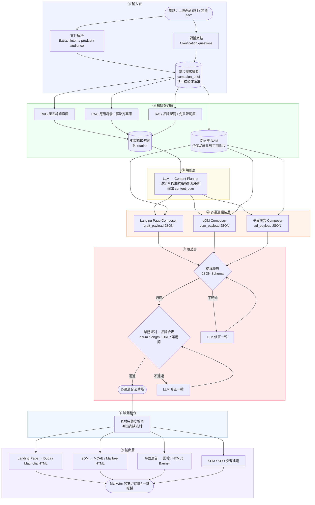

# AI Product Content Marketing 全自動化平台規劃文件

> 版本：v0.2　日期：2026-06-18　性質：產品願景 + 架構規劃，尚未進入實作階段
> 子系統：Campaign Page Builder（Landing Page）／ eDM Builder ／ 平面廣告素材 ／ 素材庫 ／ SEM-SEO 建議

---

## 一、產品願景

打造一個 **Marketer 自助式的產品內容行銷平台**：在開始一檔 Campaign 之前，Marketer 只要透過「與平台 AI 對談」或「直接丟產品資料 / 想法 PPT」，AI 就能依照事前準備好的**多樣化元件**＋**符合研華品牌的視覺模板**，一次產出整套 Campaign 內容物：

- **Landing Page**（New Release 上市頁 / Selection Guide 選型指南）
- **eDM**（電子報）
- **平面廣告素材**（Display / Print Banner）

並同時生成所需的**文案**與**圖片**。全數完成後，若素材有缺，平台會主動提醒 Marketer「尚有哪些素材需要提供」，最後可**一鍵複製出 HTML** 部署到各通道，並附上**參考用 SEM / SEO** 建議。

### 1.1 要解決的痛點

| 現況痛點 | 平台對策 |
|---|---|
| 與設計師反覆溝通、品牌視覺不停 Review | 預先封裝符合研華品牌的元件 + 模板，AI 只能在合規範圍內組合，免 Review 來回 |
| 大量產品資料檢索耗時 | 知識庫 RAG 自動擷取產品線 / 應用場景 / 規格，附 citation |
| 微調頁面但花費大量時間 | 元件化 + 資料驅動，AI 產生草稿後即時預覽、局部微調 |
| 素材庫圖片沒有統一管理 | 中央化素材庫（DAM），統一命名、標籤、版本與授權管理 |
| 設計語彙 / A-B 廠商不統一 | 單一 Style 系統（Design Token），所有產出共用同一套視覺鉤子 |
| 一檔 Campaign 要準備的東西太多、太繁雜 | 一次對話 → 同時產出 Landing Page / eDM / 平面廣告 / SEM-SEO |

### 1.2 兩種入口

1. **與平台 AI 對話**（逐步釐清 Campaign 目標、受眾、產品線、語言、CTA）
2. **直接上傳產品資料 / 想法 PPT**（活動簡報、產品重點、市場訊息、規格表）

### 1.3 產出與輸出通道

| 產出物 | 既有元件庫 | 一鍵輸出目標 |
|---|---|---|
| Landing Page | Campaign Page Builder（Duda 版、Magnolia 版元件） | Duda / Magnolia HTML |
| eDM | eDM Builder（MCAE 版、Mailbee 版元件） | MCAE / Mailbee HTML |
| 平面廣告素材 | 廣告版位模板（多尺寸） | 圖檔 / HTML5 Banner |
| SEM / SEO 建議 | — | 參考用關鍵字 / Meta / 文案建議（不自動發布） |

---

## 二、可行性判斷

**整體評估：高可行**

| 項目 | 現況 | 對 AI 整合的意義 |
|---|---|---|
| 多通道元件已就緒 | Landing Page（Duda/Magnolia）、eDM（MCAE/Mailbee）元件皆已製作 | AI 只需挑選元件並填內容，不用各通道重做 |
| Builder 資料結構 | 專案以純 JSON 表達（sections / options / edits） | AI 只需生成合法 JSON，不用寫 HTML |
| 元件合約明確 | 每個 Section 有固定的 optionMap / editMap 規格 | 可做嚴格 schema 驗證 |
| 渲染已資料驅動 | `sections` 資料直接決定畫面輸出 | 灌入草稿即可即時預覽 |
| 所有寫入路徑標準化 | `setEditValue` / `setSectionOption` 均有固定 API | 未來可接 HTTP endpoint 或直接 import |
| 一鍵輸出已驗證 | 既有 Builder 已可複製出各通道 HTML | 自動化只需在草稿確認後觸發輸出 |

---

## 三、使用者旅程

```
Marketer 要開一檔 Campaign
    │
    ▼
① 與 AI 對話 / 上傳產品資料 / 想法 PPT
    │
    ▼
② AI 提問（Campaign 類型、目標、受眾、產品線、語言、區域、CTA、要產出哪些通道）
    │
    ▼
③ AI 從知識庫擷取研華產品 / 應用 / 品牌規範（附 citation）
    │
    ▼
④ AI 規劃整套內容（Landing Page + eDM + 平面廣告 結構建議）
    │
    ▼
⑤ 確認後同時生成多通道草稿 JSON + 文案 + 圖片（取自素材庫 / 必要時生成）
    │
    ▼
⑥ 驗證（結構 + 業務規則 + 品牌合規）
    │
    ├─ 通過 ──▶ 多通道即時預覽 + 局部微調
    │
    └─ 不通過 ─▶ 自動修正一輪 ──▶ 仍不通過 ──▶ 人工審查
    │
    ▼
⑦ 缺漏素材提醒（列出尚缺：產品高解析圖 / 規格表 / 認證標章 / 影片…）
    │
    ▼
⑧ 一鍵輸出 HTML（Duda / Magnolia / MCAE / Mailbee）+ 平面廣告圖檔
    │
    ▼
⑨ 附上參考用 SEM / SEO 建議（關鍵字 / Meta / 廣告文案）
```

---

## 四、平台工作流程圖

> **說明**：以下為完整工作流設計。輸入層之後依使用者勾選的通道，分流到 Landing Page / eDM / 平面廣告各自的組裝器，共用同一份知識庫與品牌規範。



---

## 五、Schema 驗證：能在 Dify 做嗎？

**答案：可以，而且建議一定要做，分兩層。**

### Stage A：結構驗證（JSON Schema）
在 Dify Code 節點（Python）執行：

```python
import jsonschema, json

def validate_structure(draft_str: str, schema: dict) -> dict:
    try:
        draft = json.loads(draft_str)
        jsonschema.validate(draft, schema)
        return {"ok": True, "errors": []}
    except jsonschema.ValidationError as e:
        return {"ok": False, "errors": [e.message]}
    except json.JSONDecodeError as e:
        return {"ok": False, "errors": [f"JSON parse error: {e}"]}
```

驗證重點：
- `projectName`、`styleId`、`sections` 必填
- 每個 section 必須有 `sectionType`（限 enum 值）
- `options` / `edits` 欄位型別正確

### Stage B：業務規則驗證
同樣在 Code 節點執行，對照 Section Registry 規格：

| 規則 | 說明 |
|---|---|
| sectionType enum | 只允許 `hero-banner`、`feature-cards`、`feature-cards-split`、`feature-gallery`、`faq`、`site-footer` 等 |
| option 值合法 | 例如 `mask` 只能是 `none / arc / point-down` |
| 字元長度 | 標題 ≤ 120 字、描述 ≤ 300 字 |
| URL 格式 | CTA link、image URL 需符合 https:// 規則 |
| 色碼格式 | bgColor / maskColor 需為合法 hex |
| 必要區塊 | 特定 campaign 類型需有 Footer / Disclaimer |

### 修正循環機制

```
驗證失敗
  ↓
把錯誤清單 + 原始草稿 → 送回 LLM 修正（最多 1 輪）
  ↓
再驗證一次
  ↓
仍失敗 → 轉人工審查佇列
```

---

## 六、草稿資料結構（Data Contract 草案）

```json
{
  "projectName": "string — 活動頁名稱",
  "styleId": "clean-pro",
  "language": "zh-TW | en | zh-CN",
  "region": "TW | CN | NA | EU",
  "sections": [
    {
      "sectionType": "hero-banner",
      "layout": "split | full-text",
      "mode": "light | dark",
      "bg": "plain | alt",
      "options": {
        "heroBgType": "color | image",
        "mask": "none | arc | point-down",
        "showEyebrow": true,
        "showSubtitle": true,
        "showBody": true,
        "showFirstCta": true,
        "showSecondCta": false
      },
      "edits": {
        "eyebrow": "string",
        "headline": "string",
        "subtitle": "string",
        "body": "string",
        "cta1Text": "string",
        "cta1Url": "https://...",
        "bgColor": "#ffffff",
        "maskColor": "#f6f7f9"
      }
    }
  ]
}
```

**核心約束**：`sectionType` / `options` 的所有 key 與值必須對應目前 `cpb-sections.js` Section Registry，不可自創欄位。

> **多通道擴充**：上述為 Landing Page 的 `draft_payload`。eDM 與平面廣告各有對應的 payload（共用相同的驗證模式）：
> - `edm_payload` — 對應 eDM Builder 元件（MCAE / Mailbee）：blocks（hero / product / cta / footer 等），需符合郵件 HTML 限制（inline style、table 排版、寬度上限）。
> - `ad_payload` — 對應平面廣告版位：size（如 300x250 / 728x90 / 1200x628）、headline、subcopy、cta、image_ref、logo、legal。
> 三者共用同一份 `campaign_brief`、知識庫擷取結果與品牌規範，確保跨通道訊息一致。

---

## 七、研華知識庫設計

### 7.1 知識分群

| 群組 | 內容範例 |
|---|---|
| 產品線 | 工業電腦、嵌入式、IoT 平台、WISE-PaaS |
| 應用場景 | 智慧工廠、智慧零售、能源管理、醫療影像 |
| 訊息框架 | USP、差異化說法、競爭對比限制 |
| 品牌規範 | 語氣、禁用詞、允許縮寫、CTA 格式 |
| 法規聲明 | 區域免責聲明、認證資訊 |

### 7.2 Metadata 欄位（每份文件都要）

```
product_line       工業電腦 / Edge AI / ...
application_cat    智慧工廠 / 醫療 / ...
industry           製造 / 醫療 / 交通 / ...
language           zh-TW / en
region             TW / CN / NA / EU
last_updated       YYYY-MM-DD
source_owner       BU 名稱
```

### 7.3 擷取策略

1. 先以 `language + region` 篩選
2. 再以 `product_line + application_cat` 做語意排序
3. 產品規格聲明必須附 citation（來源文件 + 段落）

---

## 八、素材庫（DAM）統一管理

> 目的：解決「素材庫圖片沒有統一管理」「設計語彙 / 廠商不統一」的痛點，讓 AI 組裝時優先取用合規且已授權的素材。

### 8.1 素材分類

| 類型 | 範例 |
|---|---|
| 產品圖 | 去背主圖、情境圖、多角度圖 |
| 品牌素材 | Logo（各語言 / 各底色版本）、品牌色票、字型 |
| 圖示 / 認證標章 | 功能 icon、CE / UL / IP66 / FCC |
| 背景 / 裝飾 | KV 背景、漸層、飾紋 |
| 影音 | 產品影片、GIF |

### 8.2 每個素材的 Metadata

```
asset_id          唯一識別碼
product_line      對應產品線
type              product / brand / icon / bg / video
language/region   適用語言與區域
resolution        解析度（含是否可用於印刷）
usage_rights      授權範圍 / 到期日
brand_approved    是否已過品牌核可
tags              語意標籤（供 AI 比對）
```

### 8.3 AI 取用規則

1. Composer 需要圖片時，先以 `product_line + tags` 查素材庫
2. 命中 `brand_approved = true` 的素材優先使用，輸出時帶 `asset_id` 引用
3. 無合適素材時 → **不捏造**，改標記為缺漏（見第九節）
4. 影像生成（選配）只在明確允許時啟用，且產出需再過品牌核可

---

## 九、缺漏素材提醒

> Marketer 全數做完後，平台主動列出「尚有哪些素材需要提供」。

### 9.1 完整度檢查邏輯

針對每個通道草稿，逐一比對「必要素材清單 vs. 已取得素材」：

| 檢查項 | 範例缺漏訊息 |
|---|---|
| 產品主圖 | 「缺：XXX 產品去背高解析主圖（建議 ≥ 2000px）」 |
| 規格數據 | 「缺：規格表第 3 項數值，請補或確認」 |
| 認證標章 | 「缺：此頁宣稱 IP66，請提供對應標章或移除宣稱」 |
| CTA 連結 | 「缺：第二 CTA 的目標連結」 |
| 法規聲明 | 「缺：NA 區域免責聲明」 |
| 印刷素材 | 「平面廣告需 CMYK / 300dpi，現有素材僅 72dpi」 |

### 9.2 呈現方式

- 以「待補清單」呈現，分為**阻擋輸出（必填）**與**建議補強（選填）**
- 每項提供「上傳 / 改用替代素材 / 移除相關宣稱」三種快捷動作

---

## 十、輸出通道對應

> 一鍵複製 HTML。各通道使用既有元件庫，AI 只負責填內容與挑元件。

| 通道 | 產出 | 既有元件 | 輸出格式 | 注意事項 |
|---|---|---|---|---|
| Landing Page | 上市頁 / 選型指南 | Campaign Page Builder | Duda HTML / Magnolia HTML | 兩平台的容器與 class 規範不同，輸出時切換對應模板 |
| eDM | 電子報 | eDM Builder | MCAE HTML / Mailbee HTML | 郵件 HTML 限制：table 排版、inline style、寬度上限、暗色模式相容 |
| 平面廣告 | Display / Print Banner | 廣告版位模板 | 圖檔（PNG/JPG）/ HTML5 Banner | 多尺寸自動套版；印刷需 CMYK / 300dpi |

**原則**：同一份內容 → 一鍵切換輸出目標，不需重做；輸出前各自跑該通道的防呆驗證。

---

## 十一、SEM / SEO 參考建議

> 性質：**參考用，不自動發布**。Campaign 完成後附上，協助投放與自然搜尋。

| 項目 | 內容 |
|---|---|
| SEO Meta | 建議 Title（≤ 60 字元）、Meta Description（≤ 155 字元）、H1 |
| 關鍵字 | 主關鍵字 + 長尾關鍵字（依產品線 / 應用場景） |
| 結構化資料 | 建議的 Schema.org 類型（Product / FAQ） |
| SEM 文案 | Google Ads 標題（多組）、描述、最終到達網址建議 |
| 內部連結 | 建議連回的研華既有頁面 |

**約束**：關鍵字與文案需符合品牌規範與禁用詞；產品宣稱需可追溯至知識庫。

---

## 十二、風險與控制

| 風險 | 發生情境 | 控制方式 |
|---|---|---|
| 幻覺欄位 | AI 創造不存在的元件或 option | Schema + enum 驗證，不通過則拒收 |
| 產品資訊錯誤 | AI 憑空描述規格 | 強制從知識庫擷取，附 citation |
| 品牌不一致 | 語氣偏差、禁用詞、跨通道訊息不一致 | 業務規則層做詞彙檢查；三通道共用同一 brief |
| 草稿品質低 | 資訊不足就生成 | 強制 3–5 個澄清問題後才組裝 |
| 素材誤用 | 取到未授權 / 未核可圖片 | 僅取 `brand_approved` 素材，缺則標記待補 |
| 通道格式不符 | eDM 用了不相容 HTML、廣告解析度不足 | 各通道輸出前跑專屬防呆驗證 |
| 版本飄移 | Section 規格更新後草稿失效 | Schema 版本化，升級時通知 |

---

## 十三、MVP 範圍建議

**納入**
- 2 種 Campaign 意圖：產品上市（New Release）/ 選型指南（Selection Guide）
- 通道：先做 **Landing Page**（Duda 或 Magnolia 擇一），eDM 為第二優先
- 5–7 個常用 Section（Hero、Feature Cards、Gallery、FAQ、Footer）
- 中文（zh-TW）與英文（en）內容生成
- 素材庫比對 + 缺漏素材提醒
- 草稿匯入 Builder 成可編輯專案 + 一鍵輸出 HTML

**不納入（後續階段）**
- 平面廣告多尺寸自動套版
- 全自動發布 / 個人化內容 / 多頁旅程
- 影像自動生成
- SEM / SEO 僅提供文字建議，不串接投放

---

## 十四、成功指標

| 指標 | 目標 |
|---|---|
| 整套 Campaign 首稿生成時間 | ≤ 5 分鐘（多通道） |
| 單通道首稿生成時間 | ≤ 2 分鐘 |
| 首稿可接受率（僅需微調） | ≥ 60% |
| 平均人工修改次數 | ≤ 5 處 / 通道 |
| 事實錯誤率 | 0%（需人工確認後發布） |
| Campaign 籌備時間縮短幅度 | ≥ 50% |

---

## 十五、實作步驟（待執行）

1. **凍結元件合約** — 確認各通道（Landing / eDM / 廣告）元件 Registry 版本，導出 JSON Schema
2. **撰寫 Schema 與規則集** — 結構 Schema + 業務規則 + 品牌合規清單
3. **建置知識庫** — 整理研華產品線與應用場景文件並加 metadata
4. **建置素材庫（DAM）** — 匯入圖片並補 metadata、品牌核可標記
5. **搭建工作流** — 依第四節 Flow 圖實作各節點（先單通道）
6. **補 Builder Import 入口** — 新增草稿匯入功能（`importDraft(json)`）+ 一鍵輸出
7. **接缺漏檢查與 SEM/SEO 建議節點**
8. **Pilot 測試** — Marketer 試用 2–3 個真實案例並調整 Prompt 與規則

---

## 十六、待決定事項

| 議題 | 選項 |
|---|---|
| Schema 維護位置 | 放 Repo（版本控制）vs. 放工作流設定 |
| 首發通道 | Landing Page 先用 Duda vs. Magnolia |
| 修正循環上限 | 最多 1 輪自動修正 vs. 2 輪 |
| KB / 素材庫更新治理 | 哪個 BU 負責維護、多久更新一次 |
| 草稿審查機制 | 自動審查 vs. 人工核准才能輸出 |
| 影像生成 | 是否開放、何種情境、是否需品牌再核可 |
| 多語支援優先順序 | zh-TW → en → zh-CN |

---

## 十七、結論

> 可行性高，建議從**單通道（Landing Page）窄範圍 MVP** 開始，再橫向擴充到 eDM 與平面廣告。
>
> 工作流引擎適合同時做編排與 Schema 驗證，前提是驗證必須明確拆分為**結構層**與**業務規則 / 品牌合規層**，不能只依賴 LLM 自我審查。
>
> 最大的優勢在於：各通道元件已就緒、Builder 為 JSON 狀態架構——AI 不需要理解前端，只需要產出符合元件規格的資料結構，並由素材庫提供合規圖片，即可一次完成整套 Campaign 內容物。
