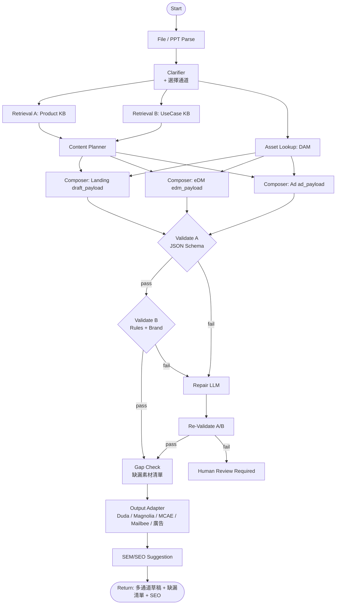

# AI 工作流設定指南（Product Content Marketing 全自動化）

> 目的：讓 Marketer 可透過「上傳產品資料 / 想法 PPT + 對話」快速產生整套 Campaign 內容（Landing Page / eDM / 平面廣告）的草稿 JSON。  
> 範圍：本文件專注在工作流設計與設定（以 Dify 為例），不包含前端實作細節。

---

## 1. 目標架構

### 1.1 產出目標
- 輸入：活動需求、產品線方向、概念文件 / PPT、要產出的通道
- 輸出：依通道產出各自的資料套件
  - `draft_payload`（Landing Page）
  - `edm_payload`（eDM）
  - `ad_payload`（平面廣告）
  - `seo_sem_suggestion`（參考用）
- 驗證：在輸出前通過「結構驗證 + 業務規則 / 品牌合規驗證」

### 1.2 核心原則
- 只允許現有元件組合，不允許自由生成 HTML
- 所有輸出必須為結構化 JSON
- 所有產品敘述優先來自知識庫擷取結果，圖片優先來自素材庫（DAM）
- 三通道共用同一份 `campaign_brief` 與品牌規範，確保訊息一致

---

## 2. Dify 應用型態與元件

### 2.1 App 類型
選擇 `Workflow`（建議），不要只用單純 Chatbot。

原因：需要多節點流程（擷取、規劃、生成、驗證、修正、匯入）。

### 2.2 需要建立的資源
1. LLM 模型（建議一主一備）
2. Knowledge（至少兩個：產品線 / 應用場景；品牌規範為選配）
3. 素材庫（DAM）查詢介面：供 Composer 依 `product_line + tags` 取用合規圖片
4. Workflow 節點（見第 4 節）
5. 可選：Validation API（外部服務）
6. 輸出轉換器（Output Adapter）：Landing→Duda/Magnolia、eDM→MCAE/Mailbee、廣告→多尺寸
7. 可選：SEM/SEO 建議生成節點

---

## 3. Knowledge 設定

### 3.1 建議拆分
1. `KB_Advantech_ProductLines`
- 產品線介紹、規格摘要、定位

2. `KB_Advantech_UseCases`
- 應用場景、產業解法、成功案例語彙

3. `KB_Brand_Compliance`（可選）
- 品牌語氣、禁用詞、法規聲明模板

### 3.2 Chunk 與檢索建議
- Chunk size：500 到 900 字元
- Overlap：80 到 120
- Top K：5（可調到 8）
- 開啟 rerank（若可用）

### 3.3 Metadata（每份文件都要）
- `product_line`
- `application_category`
- `industry`
- `language`
- `region`
- `last_updated`
- `source_owner`

### 3.4 Filter 順序
1. `language + region` 先過濾
2. 再按 `product_line + application_category` 排序

---

## 4. Workflow 節點設計（可直接照建）

## 4.1 節點總覽
1. Start
2. File Parse（文件 / PPT 解析）
3. Clarifier（需求補問，含「要出哪些通道」）
4. Retrieval A（產品線）
5. Retrieval B（應用場景）
6. Asset Lookup（素材庫比對）
7. Content Planner（跨通道結構規劃）
8. Composer × N（依通道：Landing / eDM / 平面廣告）
9. Validate A（結構驗證）
10. Validate B（業務規則 + 品牌合規）
11. If/Else（是否通過）
12. Repair（錯誤修正一輪）
13. Re-Validate（再驗證）
14. Gap Check（缺漏素材清單）
15. Output Adapter（依通道轉出 HTML / 圖檔）
16. SEM/SEO Suggestion
17. Final Output

## 4.2 Mermaid 流程圖



---

## 5. Start 節點輸入欄位

建議在 Start 節點定義：
- `campaign_goal`：頁面目的（lead / launch / story）
- `campaign_type`：new-release / selection-guide
- `target_channels`：要產出哪些通道（landing / edm / ad，可多選）
- `export_target`：landing 輸出目標（duda / magnolia）、edm 輸出目標（mcae / mailbee）
- `target_audience`：受眾
- `product_line`：產品線
- `application_category`：應用類別
- `language`：例如 `zh-TW`
- `region`：例如 `TW`
- `uploaded_files`：可多檔（含 PPT）
- `must_have`：必要區塊或訊息
- `forbidden_terms`：禁用字詞

---

## 6. Prompt 設計（核心）

## 6.1 Content Planner Prompt 重點
- 根據 brief + 檢索結果 + 已勾選通道，輸出各通道的 section / block 排序與訊息策略
- 不要填文案細節，只做架構決策
- 僅允許使用各通道已存在的 sectionType / blockType
- 跨通道訊息（主張、CTA、產品名）需一致

## 6.2 Composer Prompt 重點（各通道一個 Composer）
- 只輸出 JSON，不輸出任何自然語言
- 嚴格遵守該通道 schema（Landing / eDM / 廣告各一份）
- 缺資訊時使用保守預設，不可捏造規格
- 產品聲明需可追溯到檢索內容
- 圖片一律引用素材庫 `asset_id`；查無合適素材時填 `null` 並標記缺漏，不可自編圖片網址
- eDM Composer 另需符合郵件 HTML 限制（table 排版、inline style、寬度上限）
- 廣告 Composer 需依 `size` 控制文案字數與資訊密度

## 6.3 Repair Prompt 重點
- 輸入：原 draft + error list
- 任務：只修錯誤欄位，不改其他已正確內容
- 限制：最多一輪修正

---

## 7. Schema 驗證（Dify 內可行）

可行，建議拆成兩層。

## 7.1 Validate A：結構驗證
方法：Code 節點執行 JSON Schema 驗證。

檢查：
- 頂層必填欄位
- 型別
- 陣列結構
- section 基本欄位完整性

## 7.2 Validate B：業務規則驗證
方法：Code 節點或外部 API。

檢查：
- `sectionType` 是否在允許清單
- `options` 值是否為合法 enum
- URL/色碼/字數限制
- 必要 section 是否存在
- 禁用詞檢查

## 7.3 失敗處理策略
- 失敗先進入 Repair 一輪
- 再失敗則標記 `human_review_required=true`
- 保留錯誤清單供人工編修

---

## 8. 建議的 `draft_payload` 最小結構

> 以下為 Landing Page 的 `draft_payload`。`edm_payload`（blocks 結構）與 `ad_payload`（size + 文案 + image_ref）各有對應 schema，驗證模式相同，詳見 Planning 文件第六節。

```json
{
  "projectName": "2026 Q3 Edge AI Campaign",
  "styleId": "clean-pro",
  "language": "zh-TW",
  "region": "TW",
  "sections": [
    {
      "sectionType": "hero-banner",
      "layout": "split",
      "mode": "light",
      "bg": "plain",
      "options": {
        "heroBgType": "color",
        "mask": "arc",
        "showEyebrow": true,
        "showSubtitle": true,
        "showBody": true,
        "showFirstCta": true,
        "showSecondCta": false
      },
      "edits": {
        "eyebrow": "#EdgeAI #Industrial",
        "headline": "讓邊緣 AI 佈署更快落地",
        "subtitle": "從硬體到平台的一站式方案",
        "body": "以高可靠工業級架構，提升導入效率與可維運性。",
        "cta1Text": "立即了解",
        "cta1Url": "https://example.com/contact",
        "bgColor": "#ffffff",
        "maskColor": "#f6f7f9"
      }
    }
  ]
}
```

---

## 9. 對接各通道輸出

## 9.1 輸出轉換器（Output Adapter）
通過驗證與缺漏檢查後，依 `target_channels` / `export_target` 轉出：

| 通道 | 來源 payload | 輸出目標 | 端點建議 |
|---|---|---|---|
| Landing Page | `draft_payload` | Duda HTML / Magnolia HTML | `POST /api/builder/export-landing` |
| eDM | `edm_payload` | MCAE HTML / Mailbee HTML | `POST /api/builder/export-edm` |
| 平面廣告 | `ad_payload` | 圖檔 / HTML5 Banner | `POST /api/builder/export-ad` |

Response：`assetUrl` 或 `html`、`status`、`errors[]`

## 9.2 各通道端處理
1. 接收對應 payload
2. 做一次本地防呆驗證（該通道規範）
3. 套用對應模板（Duda/Magnolia/MCAE/Mailbee）
4. 產出 HTML / 圖檔供一鍵複製

## 9.3 防呆重點
- 不認得的欄位直接忽略或報錯
- 不合法 sectionType / blockType 直接拒絕
- URL / 色碼 / 圖片解析度錯誤給出可讀錯誤
- eDM 輸出需通過郵件 HTML 相容檢查

## 9.4 缺漏素材提醒
- Gap Check 節點輸出 `missing_assets[]`（含通道、項目、嚴重度）
- 嚴重度 `blocking` 阻擋輸出；`recommended` 可先輸出但提示補強

## 9.5 SEM / SEO 建議（參考用）
- 在輸出後附 `seo_sem_suggestion`：Title / Meta / 關鍵字 / Google Ads 文案
- 僅供參考，不自動發布；需通過禁用詞檢查

---

## 10. MVP 建議

第一階段先限制：
1. 語言僅 `zh-TW`
2. 通道先做 Landing Page（Duda 或 Magnolia 擇一），eDM 為第二優先
3. sectionType 只開 5 到 7 種
4. 修正回圈最多 1 次
5. 圖片僅取素材庫，不做影像生成
6. 僅草稿 + 一鍵輸出，不做自動發布

成功判斷：
- 2 分鐘內可產單通道首稿
- 首稿可用率達 60% 以上（僅需微調）

---

## 11. 上線前檢查清單

1. Knowledge metadata 是否完整
2. Schema 是否已版本化（例如 `v1`）
3. Validate A/B 是否都已接上
4. Repair 回圈是否有上限
5. Import API 是否有權限控管
6. 錯誤訊息是否可讀（給 Marketing 看得懂）

---

## 12. 常見問題

Q1：Dify 內建就能做 schema 驗證嗎？
- 可以，用 Code 節點即可；若要更穩定可接外部 Validation API。

Q2：可以只靠 LLM 說「格式正確」嗎？
- 不建議。一定要機器驗證（Schema + Rule），否則風險高。

Q3：為何要拆成兩層驗證？
- 結構對不對與業務合不合規是兩件事，拆開才好維護與排錯。

---

## 13. 下一步建議

1. 先把各通道元件 Registry 匯出成 `schema-v1.json`（先做 Landing）
2. 建置素材庫（DAM）查詢介面並補 metadata
3. 在工作平台建出最小工作流（先單通道，不含 Output Adapter）
4. 先跑 5 組真實 Marketing brief 做驗證
5. 再接 Output Adapter（Duda / Magnolia），進行小規模試營運
6. 驗證穩定後再橫向擴充 eDM 與平面廣告通道
